Multi-Branch Secure Enterprise Network & Smart System Design

Project Overview
This project simulates a high-security, redundant, and mobile-integrated network infrastructure connecting **Istanbul (HQ)** and **Ankara (Branch)**. The design focuses on high availability, logical segmentation, and multi-layered security to ensure seamless business operations.

Technical Implementation Details

 1. High Availability & OSPF Routing
    
Dual-Link Redundancy: Istanbul and Ankara routers are connected via **dual physical links** to prevent a single point of failure. If one cable is disconnected, the secondary link takes over immediately.

Dynamic Routing:"OSPF" is configured to manage traffic between branches, ensuring fast convergence and automatic failover.

 2. VLAN Segmentation (VLAN 10, 20 & 99)
   
The network is segmented to isolate traffic and enhance security:

VLAN 10 & 20:Designated for different department users.
VLAN 99 (Management):A restricted network for administrative tasks.
Inter-VLAN Routing: Enabled to allow communication between these segments under controlled policies.

3. Admin PC & Access Control
   
Dedicated Management: A specific "Admin PC" is configured to manage the entire network infrastructure.

Security: Critical network devices are protected with "Username and Password" authentication. Management access is strictly limited to authorized personnel.

4. Wireless Connectivity & IoT Integration
   
Wireless Access Point:Established a secure Wi-Fi zone within the office.
Smartphone Integration: A "Smartphone" is connected to the wireless network to demonstrate mobile business capabilities.
Web Server Access: The smartphone can successfully browse and access the "Internal Web Site" hosted on the enterprise server.

5. Layer 2 Security (Port Security)
   
Intrusion Prevention: "Port Security" is active on all access switches.
Violation Policy:*If an unauthorized "Laptop" is plugged into a secure port, the switch identifies the unknown MAC address and immediately "shuts down" the port (err-disabled).

6. Automated IP Management (DHCP Relay)
   
Centralized DHCP: IP addresses are assigned automatically by the central server in Istanbul.
DHCP Relay: The Ankara router acts as a relay agent, allowing branch devices to get their IP configurations (IP, Mask, Gateway, DNS) automatically from the HQ.

🛠 Features Summary
| Feature    | Implementation |
| :---       | :--- |
| Redundancy | Dual-Cable / Fault Tolerant |
| Routing    | OSPF Dynamic Routing |
| Security   | Port Security (Shutdown) & Credentials |
| Wireless   | Smartphone & Access Point |
| Web Service| Internal Web Site Hosting |
| Automation | DHCP Relay Agent |

## 📸 Project Visuals

1. Network Infrastructure & Routing
   
  Topology
   
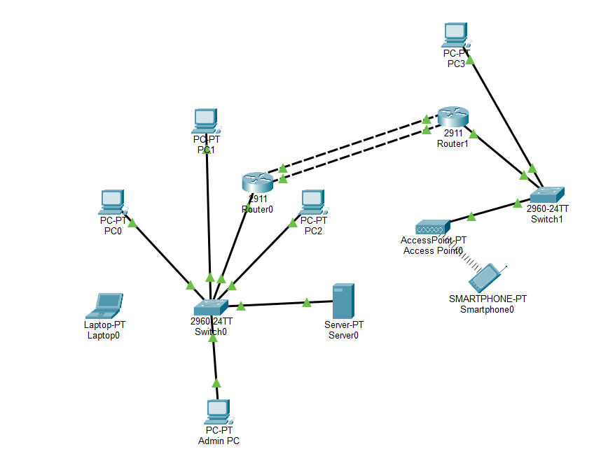
  
  OSPF Routes
  
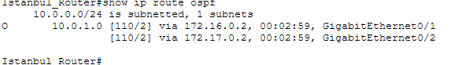
  
  Interface Status
  
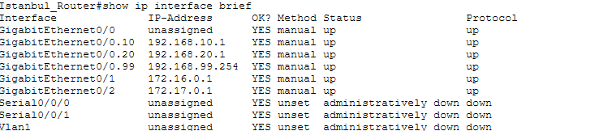
  
   VLAN Status
     
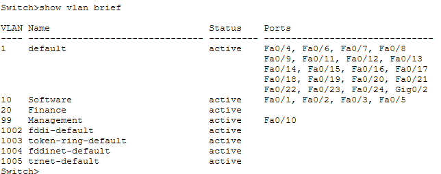
  

3. Security Implementations
     
   Login Prompt
     
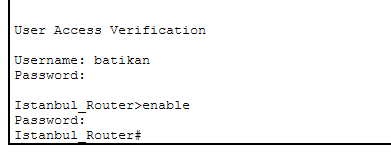
  
    Port Security Status
     
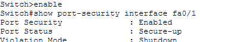
  
    Security Violation
     
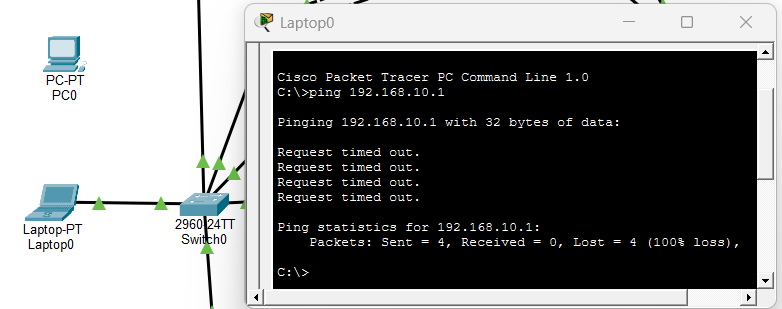
  
   Admin Telnet
     
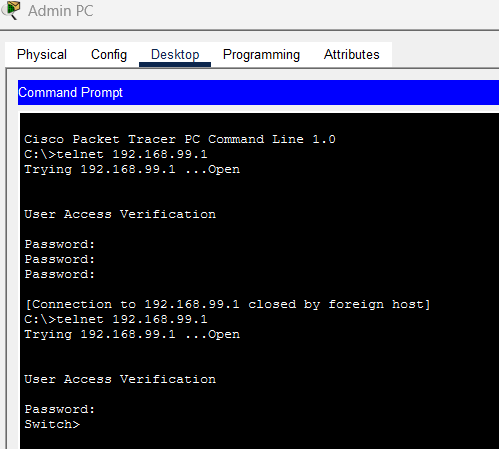
  

5. Network Services & Connectivity
     
   Ping Test
     
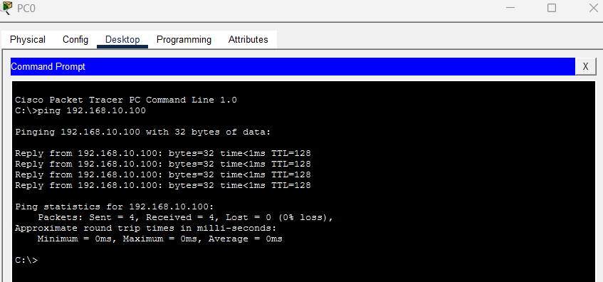
  
    DHCP Config 1
     
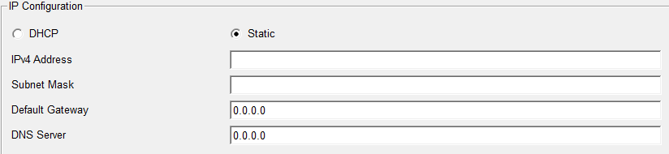
  
    DHCP Config 2
     
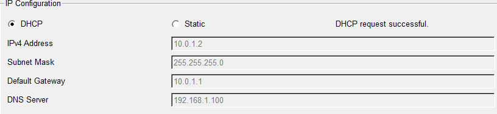
  
   Web Access
     
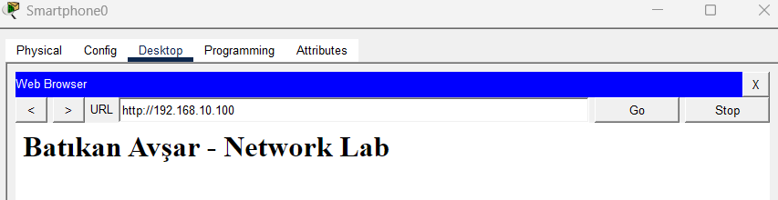
